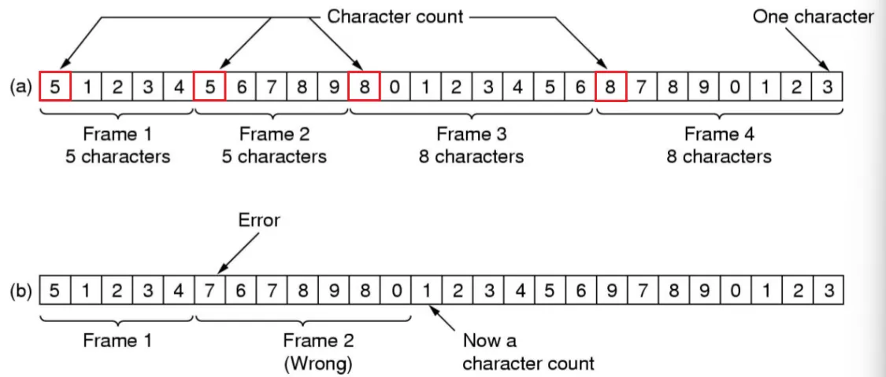
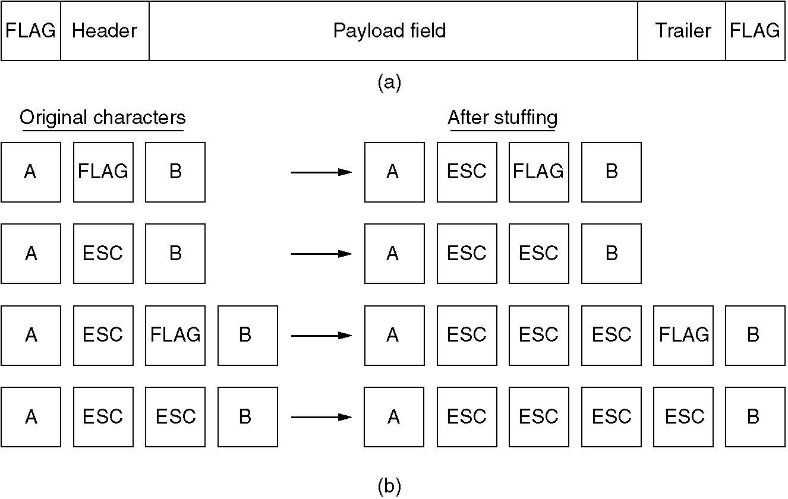
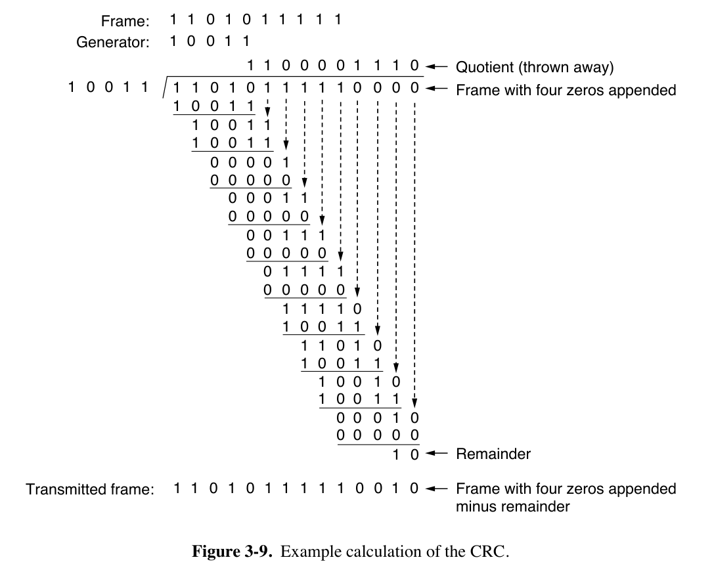
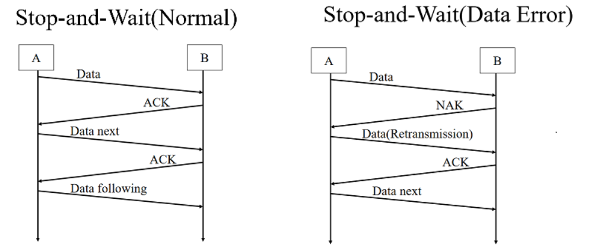
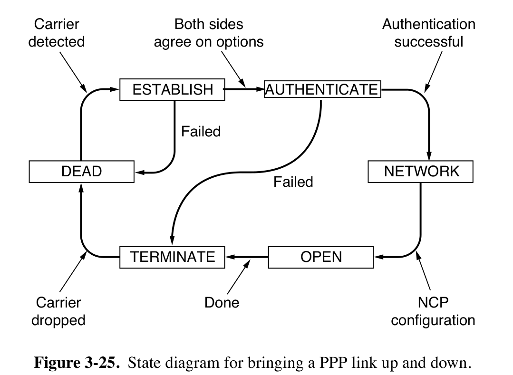

# 3: Data Link Layer

## 3.1 基本概念

- 数据链路层：构建数据链路和逻辑链路，区别于物理层，物理层构建的是物理链路
    - **物理层和数据链路层**的本质作用都是用来构建网络通信、访问通道
    - 物理链路是真实存在的物理线路和设备，数据链路层是一些必要的硬件(比如网络适配器)和软件(传输协议)组成的
    - 数据链路层向上提供网络层的服务，处理传输的错误(因为物理层不能发现传输错误)，调节数据流，确保接收方不会被淹没
- 数据链路层的服务类型
    - Unacknowledged connectionless service 无确认无连接：源主机发送帧以前不需要事先建立链路连接，目的主机收到后不需要发回确认信号。
        - 以太网是提供此类服务的典型数据链路层。
    - Acknowledged connectionless service 有确认无连接：源主机发送帧以前不需要事先建立链路连接，目的主机收到后必须发回确认信号。
        - 802.11（WiFi）是这种链路层服务的典型例子。
    - Acknowledged connection-oriented service 有确认面向连接：建立链路、传输帧、释放链路。目的主机每收到一帧都要发回确认信号。
        - 保证每个帧只被接收一次，并且所有帧都按正确顺序接收。
        - 适用于长距离、不可靠的链路，如卫星信道或长途电话电路。

### 3.1.1 组帧

- Frame（帧）：是数据链路层**发送数据的单位** 
    - Packet（数据包）和Frame的关系
    
    - Byte Count / Character Count
        - 在帧首部使用一个计数字段来记录该帧的字节数（包括字段本身）。
        - 一旦计数字段出错，帧的划分就也会出错。
    
    - Byte Stuffing
        - 用一个标志字节（记作FLAG）用作开始和结束的分隔符。
        - 问题：标志字节出现在数据帧
                - 为了避免数据段中的标志字节被当作开始或者结束符，对在它们前面加一个转义字节（ESC）进行填充
                - 为了防止数据字段末尾出现ESC字符，导致结束符FLAG被当作数据字段中普通字符，对数据字段中的ESC字符的前面也加一个ESC字符。
        - 用于PPP协议（后面讲）
    
    - Bit Stuffing
        - 用于HDLC和USB协议
        - 每个帧以一个特殊的比特串（flag sequence）开始和结束，即01111110（十六进制的0x7E）
        - 发送方扫描数据字段，发现5个连续的1就插入一个0。接收方看到五个连续的1后跟一个0时，它会自动解填充（即删除）这个0。
        - 如果接收方失去同步，它只需查找flag sequence，因为它们只能出现在帧边界。
    - Physical Layer Coding Violation
        - Manchester 编码中，用高-低电平对表示1，低-高电平对表示0，则可以用不合法的高-高和低-低表示帧的开始与结尾。
        - 将 4B/5B 编码中的保留序列作为分隔符

## 3.2 数据链路层的错误检测

- 错误控制的方式
    - Error Correcting（纠错功能）
    - Error Detecting with Retransmission（错误检测和重发）
- Error correcting code（纠错码，可能不考）
    - 假设一帧由 $m$ 个数据位和 $r$ 个冗余位组成，记 $n=m+r$， 并将该编码描述成$(m,n)$码
    - Hamming Distance（海明距离）：两个 codeword（码字）中不同的位的个数，如1000 1001与1011 0001的距离为3。可以用$D(x, y)$来表示。
        - 若干段编码组成的编码集合的hamming distance：任意两个编码组合的最小的hamming distance
        - 定理：$D(a,c)\leq D(a,b)+D(b,c)$       
        - 想要检测至多$d$位的错误，我们采用的编码中，所有编码构成的集合的hamming distance应该至少为$d+1$
        - 想要修正至多$d$位的错误，编码构成的集合的hamming distance应该至少为$2d+1$。
            - 举例：对于一组编码[0000000000, 0000011111, 1111100000, 1111111111]，hamming distance为5，最多能修正2位的错误。比如说我们接收到0000000111，如果我们认为最多会有2位出错，我们就知道正确的编码应该是0000011111；但是如果我们认为最多会有3位出错，我们边不能知道正确的编码是0000011111还是0000000000了。        
    - Hamming Code（海明码）：
        - 如果由$m$个信息位，$r$ 个校验位，则有公式$m+r+1\leq 2^r$。
        - 编码方式：比方说$m=4$，则$r=3$；将第$i$个（base 1）校验位放在第$2^i$位上，然后信息位按原顺序依次填入。
        - 海明码的海明距离为3，可以发现2bit的错误，可以纠正1bit的错误。校验位出错也能检出。
        - 假设传输的数据为8bit的00111001，在将信息位填入它们对应的位置后，对应位值为1的位序号有1010、1001、0111和0011。则Hamming Code为$1010\oplus 1001\oplus 0111\oplus 0011 = 0111$，依次填入校验位，结果为0011**0**100**1**1**11**。假设传输出现错误，接收到的数据为0011**0**110**1**1**11**，则计算Syndrome Code为$0111\oplus 1010\oplus 1001\oplus 0111\oplus 0110\oplus 0011 = 0110$，即出错位置为0110。

    - convolutional code（仅luxq，略）
- **Cyclic Redundancy Check（CRC，循环冗余校验）**    
    - 传输双方约定一个生成多项式（Generator Polynomial）。发送方生成一个校验码（CRC码），将其附加到原始数据末尾。接收方在接收到数据后，重新计算CRC码并与接收到的CRC码进行比较。
        - 生成多项式的最高位和最低位必须是1，每个生成多项式都可以表示为一个二进制数。举例来说，CRC-4的生成多项式为10011，即$x^4 + x + 1$。
        - CRC码计算流程如下：
            - 在原始数据后面添加生成多项式长度减1个0（即CRC码的位数）。例如，对于生成多项式CRC-4（5位），则在数据后面添加4个0。
            - 将预处理后的数据（原始数据 + 添加的0）与生成多项式进行模2除法运算。
                1. 将生成多项式与被除数（预处理后的数据）对齐，从最高位开始进行异或运算。
                2. 将异或结果作为新的被除数，继续与生成多项式进行异或运算，直到所有位都被处理。
            - 将计算得到的余数（也就是CRC校验码）附加到原始数据后面，替换掉之前添加的0。
     - r阶的多项式能够检测所有长度$\leq$r的突发错误，长度大于r+1的错误漏检的概率为$(1/2)^r$。

## 3.3 数据链路层的基础协议

- `Protocol 1` Utopia协议：无限制simplex（单工）协议
    - 认为不会丢帧或者帧损坏

### 3.3.1 Stop-and-Wait Protocols（停止-等待协议）

- `Protocol 2` 
    - 最简单的通信协议，simplex traffic（单向通信），认为不会丢帧或者帧损坏。        
    - 可以解决发送速率大于接收速率的问题。       
    - 基本思路：每次发送一个包，发送完毕不立即发送下一个数据包，开始计时。等到接收方收到**表示发送成功的数据包(ACK)**之后，才可以进行下一次的发送。
    - Half-duplex channel足以支持该协议。
- `Protocol 3` 
    - 可以解决丢帧或者帧损坏问题，实现方法称为称为ARQ（Automatic Repeat reQuest，发送方超时了就可以重发而不必等待接收方信号）或PAR（Positive Acknowledgement with Retransmission，用ACK表示收到数据）
    - 添加帧头部序列号和超时重传
        - 如果发送方收到了NAK包，需要重新发送同一个数据包
        - 如果数据丢失或者ACK丢失，发送方在一定时间内等不到接收方的回复数据包，就会Time Out，尝试**主动重发**。
        - 如果是ACK丢失，接收方在收到重发后丢弃原来接收的数据。
        - 引入一个1bit的序列号，使得接收方可以区分一个帧是重传的还是新来的。每发一次，序列号由0变1或由1变0。
    - 协议效率的计算
        - $T_{frame}$ 表示发送方**发出去完整的一个帧**需要的时间，$T_{prop}$ 表示传输到接收方需要的时间
        - $T_{prop}=\frac{distance}{\mathcal {speed}}$ 而且 $T_{frame}=\frac{frame\_size}{bit\_rate}$ 
        - 令$\alpha = \frac{T_{prop}}{T_{frame}}$ 则链路利用率 $U=\frac 1 {2\alpha +1}$ 
    - 停止等待协议的编程实现（不考，略）

### 3.3.2 Sliding Window Protocols（滑动窗口协议）

- Bidirectional transmission 
- Piggybacking（稍待确认）：无需每个数据帧都返回ACK，而是在下一个数据帧中捎带确认信号。
- Sliding window（滑动窗口）：发送方与接收方分别维护一组序列号（窗口），分别对应允许发送的帧以及允许接收的帧。
    - 发送方的窗口随着新帧的发送和确认帧的接收而调整，接收方的窗口随着帧的接收和传递给网络层而调整。
    - 允许乱序接收
---

- `Protocol 4` 1-bit Sliding Window Protocol（滑动窗口协议）
    - 与停止等待协议区别不大，不过可以双向传输
- `Protocol 5` GBN（Go back N，后退N帧协议）
    - 发送方在发送N个数据帧后，如果发现这N个帧的前一个数据帧在计时器超时的时候仍然没有收到确认信息ACK，则重新传输出错帧及随后N个帧。接收方只按序接收数据帧，如果出现损坏帧或者丢帧，则丢弃后面接收到的所有帧。
    - Cumulative Acknowledgement（累计确认）：为了降低开销，接收方可以在正确接收到连续n个帧后，只对最后一个帧发送确认信息，而无需确认前面的帧。
    - 缓冲区：由于发送方可能需要在未来的某个时间重传所有未确认的帧，因此它必须缓冲所有已传输的帧，直到收到相应的ACK信号。
    - 如果采用n比特对帧进行编号，发送窗口大小$W_T$有$1<W_T\leq 2^n-1$。或者使用 MAX\_SEQ + 1 个不同的序列号，并且最多允许 MAX\_SEQ 个未确认的帧，则发送方的窗口大小不能超过 MAX\_SEQ，由于ACK有累计确认，再大会造成无法分辨丢失与成功到达的ACK。
    - 接收窗口大小$W_R=1$。
    - 在发送端为每个未确认的帧引入一个计时器，如果超时未确认则重传。
    - 信道误码率较大时，效率不如停止等待协议。
    - 如果没有反向流量，则发送方无法接收确认信息。
    - GBN的编程实现（不考）
        - 用`next_frame_to_send`和`ack_expected`记录发送情况，用`frame_expected`记录接受情况（注意protocol 5是全双工的）。

- `Protocol 6` Selective Repeat（选择性重传）

    - 发送方不需要发送丢失之后的所有数据帧，只重传出现错误的帧或者未收到ACK的帧；接收方对出现错误的帧返回NAK信号返回指定帧。接收方需要帧缓冲区，暂存顺序被打乱但是序号处于接收窗口中的数据帧，接收结束后才传给网络层。
    - 连续正确接收到数据后，接收方窗口向前移动，一直到尚未接收到对应数据的位置；接收到ACK信号后，发送方窗口向前移动，一直到没有收到ACK的位置。
    - 发送窗口的大小$W_T$不能大于(MAX\_SEQ+1)/2，否则重传时无法区分接收窗口内的新序号与重传的旧序号；接收端窗口大小$W_R\leq W_T$，否则接收窗口永远不可能填满。

    

## 3.4 Example Data Link Protocols

### 3.4.1 HDLC

- 起始和结束都是8bit的01111110，8bit address，8bit control，若干位data，16位checksum。
- bit-oriented protocol
- 不同类型的帧的Control Field不一样
    - 信息帧
        - Seq就是像Protocol 5那样的发送方序列号
        - Next是期望收到的帧的Seq，但与ACK不同，它是 (ack+1) mod 8。
        - P/F是轮询位，值为1时，被轮询的站对于主站要求必须响应。
    - 监督帧的Type域：
        - RR(Receive Ready),接收准备就绪
        - RNR(Receive Not Ready): to implement flow control
        - REJ(Reject): like NAK frame,从Next起的所有帧都被否认,但确认序号为Next-1及其以前的各帧
        - SREJ(Selective Reject),选择性拒绝
    - 无符号帧的Type域：
        - request to establish connection: SNRM(Set Normal Response Mode), SABM(set asynchronous balanced mode)
        - request to disconnect: DISC(Disconnect)
        - response frame: UA(unnumbered acknowledgement)
        - report severe error: FRMR(FRaMe Reject)
- HDLC是可靠传输协议，因此需要双方协商是否需要开始传输。目前已经不常用了，原因是TCP/IP协议已经实现了可靠传输，在链路层再实现就显得冗余了。

### 3.4.2 PPP

- 该进自SLIP，用于Internet

- byte-oriented protocol，所有帧都是整数字节

- 是一个点对点的协议，需要提供身份验证

- 包含三个主要功能
    1. 成帧
    2. LCP：用于启动、测试、协商选项，并在不再需要时关闭链路。
    3. NCP：用于协商网络层选项，每个网络层协议都有对应的 NCP。
    
- 帧结构
    - 以 HDLC 标志字节 01111110（0x7E）开始，如果标志字节0x7E出现在有效载荷字段中，需要转换为0x7D 0x5E。
    - 地址字段始终设置为二进制值 11111111。
    - 控制字段默认值为 00000011，表示一个无编号帧。
    - 在LCP中，或者采用其他压缩方法时，可以省略地址字段和控制字段。
    - 协议字段负责告诉有效载荷字段中是什么类型的数据包（IPv4、IPv6、AppleTalk等）。
    - 校验字段通常为2字节，也可以为4字节。
    
- 用于在链路中发送数据包的协议，包含光纤链路（SONET）和ADSL
    - PPP 可以在 SONET 上使用，使用4字节校验和，建议不要压缩地址、控制和协议字段。
    

- PPP 链路的建立与配置

