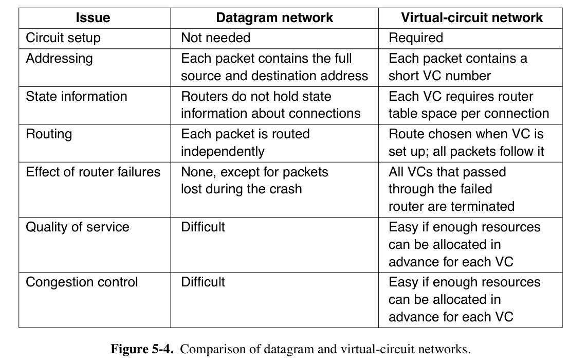
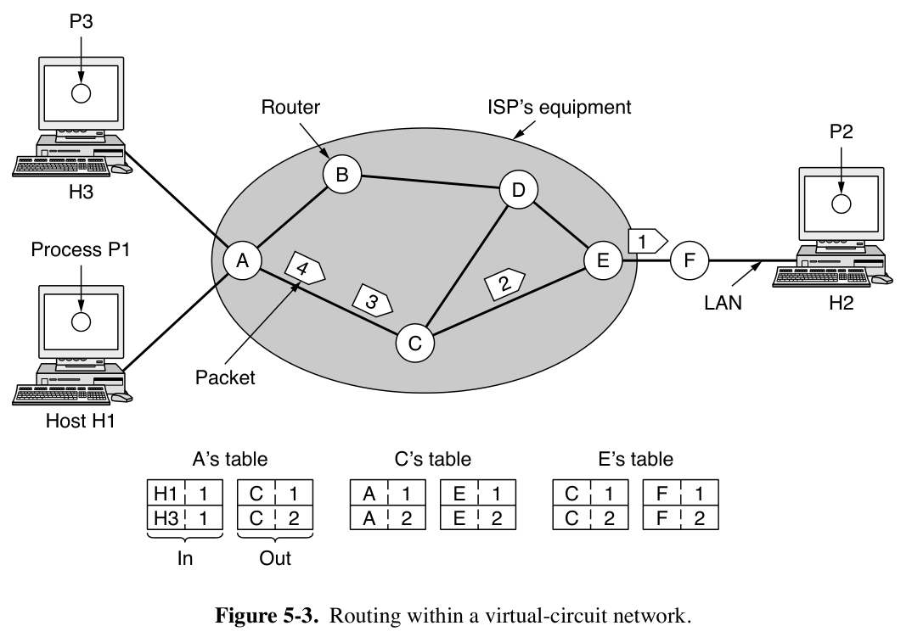
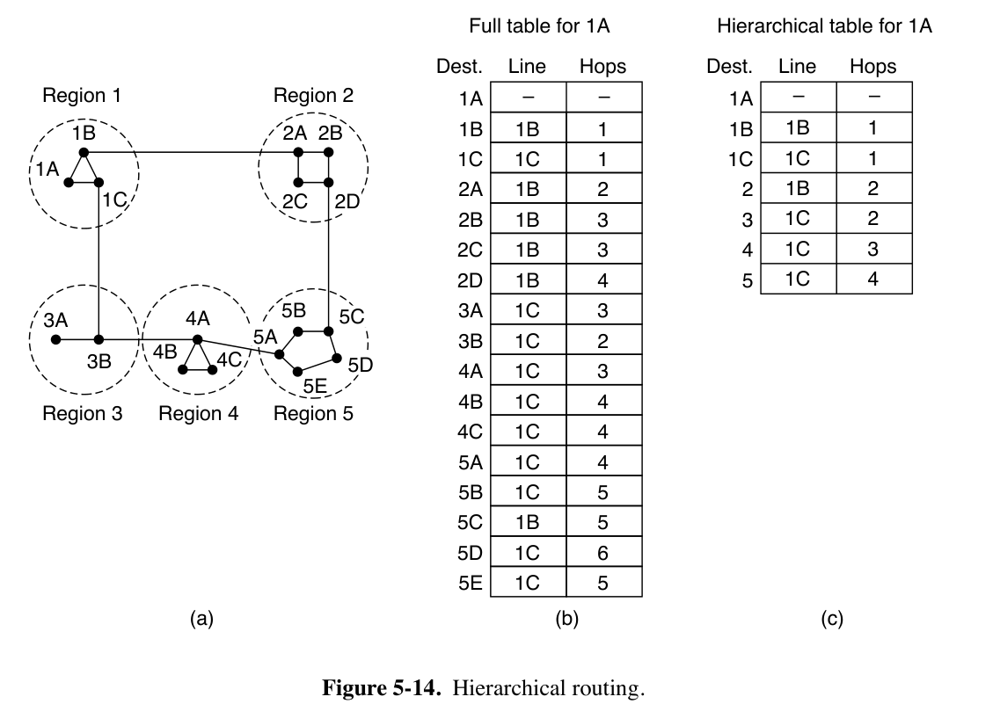

# 5: Network Layer

- 网络层

## 5.1 Network Layer Design Issues

- The network layer is the lowest layer that deals with end-to-end transmission.
    - Data Link Layer 只关心帧在 wire 上的传输
    - 主要研究数据包在路由器之间的转发过程
- 网络层必须知道网络的 topology（拓扑结构，即所有 routers 和 links 的集合），并选择适当的路径进行传输。
- Network Layer向Transmission Layer提供的服务
    1. 服务应独立于路由器技术。
    2. 传输层应不受现有路由器的数量、类型和拓扑结构的影响。
    3. 提供给传输层的网络地址应使用 uniform numbering plan（统一的编号方案），即使在局域网（LAN）和广域网（WAN）之间也是如此。
- 路由器的任务
    - Forwarding: To handle each incoming packet, look up the route table, then forward to a output line.
    - Filling and updating the route table.
- 网络层有提供 Connection-oriented Service 和 Connectionless Service 两种实现
    - Connectionless Service
        - end-to-end（端到端）
        - 只提供SEND PACKET和RECEIVE PACKET两个基本操作
        - 网络层不进行 packet ordering（数据包排序）和flow control（流量控制）
            - 主机自行进行 error control（error detection & correction）以及flow control
        - 在这里，packets（数据包）被称为 datagrams（数据报），网络被称为 datagram network（数据报网络）
        - 不需要advanced setup
        - 举例：IP 协议
    - Connection-oriented Service
        - 必须在发送任何数据包之前，建立从源路由器到目的路由器的路径
            - 预先建立的连接称为 Virtual Circuit（VC，虚拟电路）
        - 举例：ATM、MLPS

### 5.1.1 Connectionless Service

- 每个路由器通过Routing table（路由表）决定如何将数据包向目标路由器的方向传递
    - 路由表可以在运行过程中随时被路由器修改
    - 举例：从A到F发送四个数据包
        - 发送前三个时，路由器根据路由表，决定通过C发送
        - 发送第四个之前，路由器处于某些决策改变了路由表，决定通过B发送
            - 这个决策算法称为Routing algorithm（路由算法）

### 5.1.2 Connection-oriented Service

- 每个数据包携带一个 connection identifier（连接标识符），指示它属于哪个虚拟电路
    - 路由器需要能够替换 outgoing packages（出站数据包）中连接标识符，以方便后续路由器区分数据包所属VC

## 5.2 Routing Algorithms

- 算法目标：correctness、simplicity、robustness、stability、fairness and optimality
    - stability: converge quickly（快速收敛）
        - 收敛指的是每个路由器对最佳路径的学习过程
    - fairness & optimality 有时相互矛盾
- 路由算法的分类
    - Nonadaptive algorithms（非自适应算法）：决策不受当前 topology 和 traffic 变化的影响
        - 又称 static routing
    - Adaptive algorithms（自适应算法）：决策随着当前 topology（有时还包括 traffic）的变化而调整
        - 又称 dynamic routing

- The Optimality Principle（最优性原理）
    - 如果路由器J位于从路由器I到路由器K的最优路径上，那么从J到K的最优路径应该是I到K路径的一部分
    - 推论：从所有源到给定目的地的最优路径的集合一定会形成一棵以目的地为根的树（即sink tree 汇聚树）
        - 汇聚树可以不唯一，汇聚树的并集构成有向无环图（DAG，Directed Acyclic Graph）
        - 依赖于一个Assumption：paths do not interfere with each other

### 5.2.1 Shortest Path Algorithm

- 测量路径长度的方法可以包括 number of hops（跳数）、物理距离、mean delay（平均延迟）等
    - 可以生成一个权重函数
- Dijkstra 算法
    - 这里不展开了，可以[回忆一下FDS](https://ziji-cs.github.io/T-FundamentalDataStructure/9-x.html#dijkstras-algorithmfor-weighted-shortest-paths)

### 5.2.2 Flooding（洪泛）

- 每个传入路由器的数据包都会在除了到达线路之外的所有传出线路上发送
- 避免产生指数级重复数据包的措施
    - Hop counter in packet header（跳数计数器）
        - 每跳一次计数器减一，当计数器达到零时丢弃该数据包
        - 计数器初始化为从源到目的地的路径长度，或者the full diameter of the network（直径）
    - Sequence Number（序列号）
        - 源路由器在从其主机接收到的每个数据包中放入一个序列号
        - 每个路由器需要为每个源路由器保存一个列表，记录从它哪里收过哪些序列号
        - 可以用一个计数器k，如果数据包序列号小于k，则认为已经洪泛过
- 洪泛的延迟最短（如果不考虑操作本身对流量的挤占的话）

### 5.2.3 Distance Vector Routing（RIP）

- 即RIP（Routing Information Protocol）或者 Bellman-Ford Routing Algorithm
- 每个路由器维护一个routing table（路由表），即 vector
    - 按路由器索引
    - 每个路由器一个entry
        1. 以这个路由器为目的地的 preferred outgoing line
        2. 到该目的地的最小距离估计（estimate of the distance to that destination）
            - 标准可以是 hop number，也可以是其它
            - 如果用传播延迟，路由器使用特殊ECHO数据包来测量延迟
- 算法流程（以传播延迟为例）
    - 每隔T毫秒，每个路由器与每个邻居交换一个列表，其中列出它对到每个目的地的延迟的估计。
    - 假如说$d_x(y)$表示从节点$x$到节点$y$的最小距离估计，现在让节点$x$与所有相邻节点$v$交换distance vector，则$d_x(y)$取各个$v$节点的$d_v(y)+c(x,v)$中的最小值，其中$c(x,v)$表示二者之间的直连距离（这里表现为从$x$到$v$的延迟）。
    - 同时与多个邻居交换数据
    - 注意，计算过程中**不使用**自身存储的上一周期计算的路由表

- Count-to-infinity Problem
    - RIP converges slowly，好消息传得快，坏消息传得慢
    - 举例来说，考虑下图的线性网络，以hop number为
        - 假设最初A处于关闭状态，则其它路由器均将它们到A的距离记为无穷大
        - 假设此时打开A，则与A距离为$N$跳的路由器可以在$N$次交换时间内更新到A的距离
        - 假设此时关闭A，则B在下次交换时，听不到A的信息，则$d_A(A)+c(B,A)=\infin$；然后从C知道C到A的距离$d_C(A)=2$，则B将自己到A的距离更新为$\min(\infin, d_C(A)+c(B,C))=3$。
            - C在下次交换时，发现周围B和D到A的距离都是3，则它将自己到A的距离更新为4。
            - 经过很久，所有路由器中到A的距离才能回到无穷大。

- Distance Vector Routing 的缺点
    - Take too long to converge
    - Not taking bandwidth into account

### 5.2.4 Link State Routing

- 举例：IS-IS和OSPF。区别是IS-IS可以同时携带多个网络层协议的信息（例如，IP和AppleTalk），而OSPF不会。

- 操作方法

    1. 发现其邻居并学习它们的 network addresses。

        - 路由器启动时，向每个相邻的路由器发送特殊的HELLO数据包

        - 每个相邻的路由器发送一个回复，其中包含它的全局唯一名称

        - 如果多个路由器通过 broadcast link（如交换机、环网或经典以太网）连接，将这些局域网本身视为一个节点。（见下图）

            

    2. 设置到每个邻居的距离或 cost metric（成本度量）。

        - 每个路由器到每个邻居的成本。可以自动设置也可以管理员手动设置
            - 举例：成本与链路带宽成反比
            - 举例：链路延迟
                - 测量方法：在链路上发送特殊的ECHO数据包，要求链路立即发送回来，将往返时间除以二作为延迟的估计时间

    3. 构建一个包含刚才学习到的信息的数据包（link state package）。

        - 数据包包含 sender identity（发送者身份）、sequence number、age、neighbor list including costs
        - 构建数据包时机：可以以固定时间间隔构建，或者在发生特定事件（邻居状态变化或者本身属性变化）时构建。OSPF采用后者。

        

    4. 向所有其他路由器 distribute（分发）此数据包，接收来自其它路由器的包。

        - 基本分发方法：flooding
            - 每个数据包包含一个 sequence number（序列号），每次发送新数据包时递增
            - 路由器会跟踪它们看到的所有（源路由器，序列号）对
                - 如果到达的数据包的序列号低于迄今为止看到的最高序列号，则视为过时并丢弃
            - 这个算法有诸多问题。
                1. 序列号溢出
                    - 解决方法：32位序列号，用不完
                2. 路由器崩溃会丢失其对序列号的跟踪
                3. 序列号传输过程中可能因包损坏而损坏
            - 解决方法：每个数据包中包含一个age，每秒递减。
                - 路由器中记录的某个路由器的age变为0时，这一entry失效。
                - 在initial flooding过程中，每个路由器也会递减age。
        - 改进：收到数据包后不立即转发，先在 packet buffer 中暂存片刻

            - 如果收到了来自同一源的数据包，则取序列号更低的
            - 所有link state package都需要acknowledge
        - 举例：上图中的B路由器

            - 对于它的三个邻居ACF，每个邻居都有一个对应的send和ACK位。
                - send位表示这一条的数据包需要转发给这一位为1的邻居
                - ACK位表示需要向这一位为1的邻居确认
                - 如果原始数据包仍在缓冲区时，有重复的数据包到达，则需要更改标志位
                - 举例：来自E的数据包到达了两次，一次通过EAB，一次通过EFB。因此，它只需要发送到C，但必须向A和F确认。

            

    5. 计算到其它每个路由器的最短路径。

        - 完整的拓扑结构被分发到每个服务器（甚至一条边的信息重复两次），每个服务器自己运行 Dijkstra 算法

### 5.2.5 Hierarchical Routing

- 为了避免路由表过大，将大规模网络分成几个区域，每个路由器记录它到区域的距离。
- 路由器无需了解其它网络结构的拓扑结构。
- 代价是部分情况下，选择的链路的路程可能更长，如下图中1A到5C最近是走region 2，但实际走region 3。

## 5.3 Traffic Management

- Congestion（拥塞）的意思是，如果网络中某个部分的数据包过多，会导致数据包延迟和丢失，从而降低性能。网络层与传输层共同负责它的处理。
    - 传输层中，用congestion control来指代拥塞的处理
    - 网络层中，我们讨论的是congestion management（或称 traffic management）
    - 注意congestion control、traffic management 和 flow control 之间的区别。
        - flow control 关心的是一对发送方与接收方之间的流量，保证发送方不会以接收方无法处理的速度传输数据。
        - congestion management & control 确保网络能够承载各部分产生的流量。涉及一整个网络中，所有主机和路由器的行为。
- 拥塞的具体表现是，如果路由器处理速度不足，内部缓冲区被填满，导致数据包丢失。
- 还有一种原因是，由于延迟较大，部分路由器没收到确认，会大量重传

5.3.2 居然不考，那不学了。

## 5.4 Quality of Service（QoS）

QoS四指标：bandwidth, delay, jitter, and loss

- jitter（抖动）指的是延迟或数据包到达时间的变化（即标准差）

Overprovisioning（过度配置）：构建一个具有足够容量的网络，以应对任何流量。成本过高。

互联网目前有两种服务质量版本：集成服务（Integrated Services）和区分服务（Differentiated Services）。

5.4.3-5.4.5 简单考，先跳过了。

## 5.5 Internetworking

IP协议提供了一种通用的数据包格式，所有路由器都能识别，并且几乎可以在任何网络中传递。

注意 routing 与 switching（bridging）存在本质区别，后者只需要基于MAC地址传输帧，前者则还需要从数据包中提取网络地址。

能够处理多种网络协议的路由器称为多协议路由器（multiprotocol router）。它必须要么转换协议，要么为更高协议层留出连接。这两种方法都不完全令人满意。

路由器无法在不同网络（network）之间转换数据包，如IPv4与IPv6的不兼容问题。

连通不同的网络非常困难，只有一种特殊情况容易解决：源主机和目标主机位于相同类型的网络上，只是中间隔着一个不同的网络。

- 举例来说，从IPv6过IPv4到IPv6，只需要用上面提到的多协议路由器将IPv6数据包装进IPv4数据包中，后面再用多协议路由器去掉IPv4数据包，露出IPv6数据包来传输。

Internetwork Routing（Routing Across Multiple Networks）：跨网络进行路由

- 采用两级路由算法。
    - 在网络内部，使用 intradomain or interior gateway protocol（域内或内部网关协议）进行路由，采用的可能是前面提到的 link state routing
    - 在组成互联网的网络之间，使用 interdomain or exterior gateway protocol（域间或外部网关协议）。不同网络之间必须使用同样的域间网络协议。
        - 互联网中，域间路由协议称为边界网关协议（BGP，Border Gateway Protocol）

每个网络层协议或者链路层协议都对数据包的大小由一定的限制。

- 传输尽可能大的数据包可以减小主机开销，但是源主机不知道数据包会经过哪些网络，也就不知道要采用多小的数据包。

- 一种解决方法是，采取这些网络中最小的数据包。

    - 这个数据包大小称为路径最大传输单元（path MTU，Path Maximum Transmission Unit）

    - 即使源主机在发送时知道 Path MTU，网络的路由也可能发生变化，从而改变数据包会经过的网络。

    - 现代互联网仍然采用这个方法，称为 path MTU discovery。

        - IP数据包头部指示不允许分片。
        - 如果路由器接收到一个太大的数据包，它会生成一个错误数据包，将其返回给源，并丢弃该数据包。
        - 当源接收到错误数据包时，它使用其中的信息将数据包重新分片为路由器可以处理的小片段。
        - 如果路径上的另一个路由器的MTU更小，重复进行这个过程。
        - 除了路由变化问题，这个方案本身会增加 startup delay（或者说，需要尝试很多次才能真正开始发送）。

        

- 另一种解决方法是，路由器将数据包分解成片段，将每个片段作为单独的网络层数据包发送。

    - 策略1，transparent fragmentation（透明分片）：数据包的分片操作对后续网络透明。

        - 过大的数据包到达路由器G1时，G1将其分解，分解产生的每个片段都指向同一个出口路由器G2，在G2将片段重新组合。
        - 问题
            - 由于必须经过一个指定的路由器，routing过程受到限制。
            - 路由器需要缓冲到达的片段，并在未接收到所有片段时决定何时丢弃它们
            - 数据包可能被反复分片和重复组装

    - 策略2，非透明分片：避免在中间路由器上重新组合片段，只在目的地主机上进行重新组装。

        - 被IP采用

            - 为每个片段提供一个数据包编号（在所有数据包上携带）、数据包内的绝对字节偏移量以及一个指示它是否是数据包结束的标志。

        - 优点

            - 路由器负担低
            - 可以多次分片
            - 可以分片段重传
            - 可以是任意大小

        - 问题

            - 开销高于透明分片，因为每个片段都有一份数据包头，但数据包头在link layer传输时不一定用得到。
            - 分片对性能影响过大：如果丢失了任何一个片段，整个数据包都会丢失，需要重传。

            
