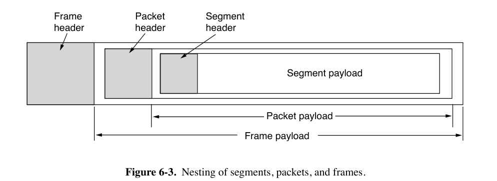
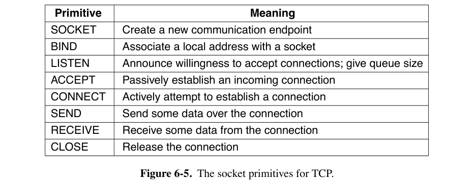
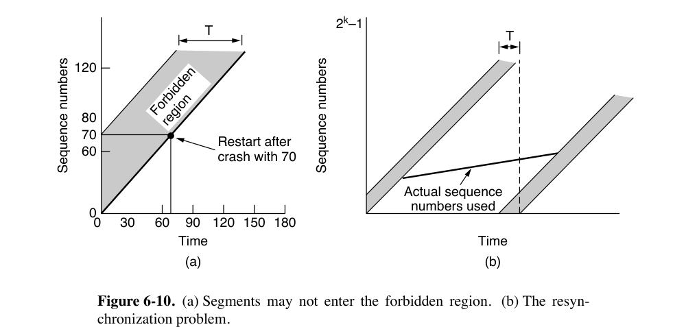
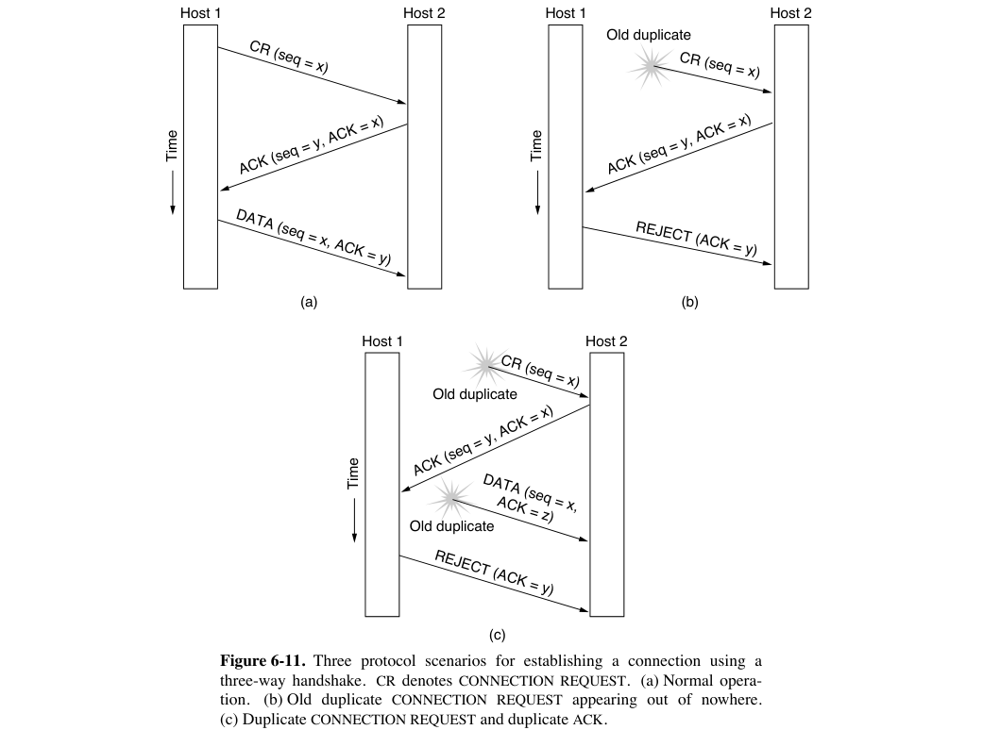
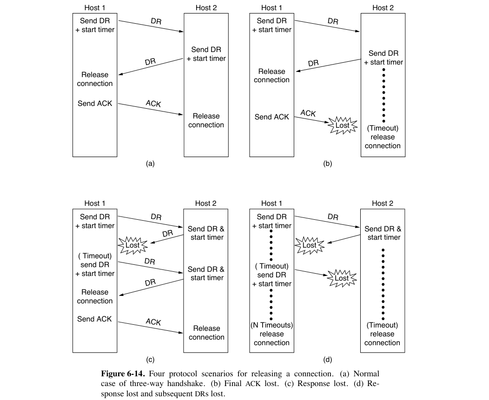
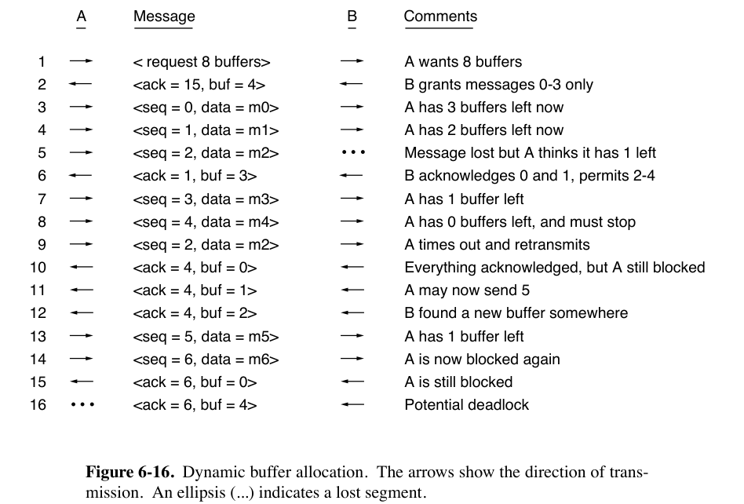

# 6: Transport Layer

## 6.1 Transport Service

- 传输层服务也分为面向连接和无连接两种
    - 两种均有三个阶段：建立、数据传输和释放
    
- 在传输层中进行工作的软件和/或硬件称为 transport entity（传输实体）。

    - 用 segment（段）或者 TPDU（Transport Protocol Data Unit）表示传输实体间传输的消息。

        

- 传输层的代码完全运行在用户机器上，而网络层主要运行在路由器上。

- 使用传输层，OSI model 可以分为两部分：
    - Layers 1-4：transport service provider
    - Layers 5-7：transport service user

- 传输层隐藏网络服务的缺陷，即使用户进程位于不同的机器上，它们也可以假设存在一个无错误的比特流。

    - 传输层也可以提供 unreliable service（datagram），跟网络层的 datagram 道理差不多，这里不展开

- 网络服务只会被传输实体看到，但传输服务会被很多程序看到，因此需要一套简单的 primitives（原语）。

??? info "原语举例（感觉不如直接看下面的TCP原语）"
    考虑一个带有服务器和多个远程客户端的应用程序。
    - LISTEN：服务器调用库进程，阻塞服务器，直到有客户端出现
    - CONNECT：客户端想要与服务器通信时调用，用于建立连接。
        - 传输实体阻塞调用它的进程，向服务器发送 CONNECTION REQUEST 段。
        - 该段到达时，服务器的传输实体检查服务器是否在 LISTEN，如果在，它解除对服务端的阻塞，向客户端发送 CONNECTION ACCEPTED 段。
        - 当该段到达时，客户端被解除阻塞，连接建立。
    - SEND & RECEIVE：任何一方都可以执行一个（阻塞的）RECEIVE 来等待另一方执行 SEND。当段到达时，接收方被解除阻塞，然后它可以处理段并发送回复。
        - 传输层中每个发送的数据包都要被确认，传输实体也需要处理计时器和重传。
    - 断开连接有两种。
        - asymmetric variant：任何一方都可以发出一个 DISCONNECT 原语，发送一个 DISCONNECT 段到远程传输实体。到达后，连接被释放。
        - symmetric variant：当一方执行 DISCONNECT 后，不再发送更多数据，但仍然接受来自对方的数据。
    - 状态转换图如下。这里假设每个段都单独确认。我们还假设使用对称断开连接模型，客户端首先断开连接。
        

- TCP Socket 原语

    - 用于UNIX系统和Windows `winsock` API

        

    - 服务器端

        - SOCKET 原语创建一个新的 endpoint，并在传输实体中为其分配 table spaces。
            - 调用时指定要使用的 addressing format（寻址格式）、所需的服务类型（例如，可靠的字节流）以及协议。
            - 返回文件描述符（就像文件的OPEN调用一样）
        - BIND 原语分配网络地址。
            - 一旦服务器将地址绑定到套接字，远程客户端就可以连接到它。
        - LISTEN 原语为 incoming calls 分配 queue 空间，以防多个客户端同时尝试连接
            - Socket 模型的 LISTEN 不是一个阻塞调用
        - ACCEPT 原语阻塞并等待传入的连接
            - 当请求连接的段到达时，传输实体创建一个与原始套接字具有相同属性的新套接字，并返回其文件描述符。
            - 服务器可以fork出一个进程或线程来处理新套接字上的连接，并返回到原始套接字上等待下一个连接。

    - 客户端

        - 先使用 SOCKET 原语创建一个套接字，但不需要BIND
        - CONNECT 原语阻塞调用它的进程，并启动连接过程。
            - 连接进程从服务器接收到适当的段后，客户端进程被解除阻塞，连接建立
        - 使用 SEND 和 RECEIVE 在 full-duplex 连接上传输和接收数据
            - 也可以使用标准的UNIX READ和WRITE系统调用
        - symmetric connection release：当双方都执行了CLOSE原语时，连接被释放。

    - Socket API + TCP = 一个称为 reliable byte stream 的 connection-oriented service

    - 可以被用于其它 transport services，如 DCCP（Datagram Congestion Control Protocol）具有拥塞控制的UDP版本。

    - Socket API在每个流中进行拥塞控制，不如在整个group中进行

        - SCTP（Stream Control Transmission Protocol）和QUIC解决了这个问题。
- 例程
    - 写过Socket那个实验就都明白了，此处略。

## 6.2 Elements of Transport Protocols

### 6.2.1 Addressing

- 建立连接时，通过定义 transport address（传输地址），指定与 remote endpoint 的哪个进程连接，让进程在这些地址上监听连接请求。
    - 这些 endpoints 被称为 ports（端口）
    - 使用 TSAP（Transport Service Access Point，传输服务访问点）来表示传输层中的特定端点
    - 相似地，网络层中的端点（即网络层地址）被称为NSAP（Network Service Access Point，网络服务访问点）。
        - 例如IP地址。
    - 进程附加到 TSAP 的方法超出了网络模型的范围，完全取决于操作系统
    - 问题：与先前不知道 TSAP 地址的其他用户进程通信
        - 引入 portmapper（端口映射器）特殊进程
            - 用户发送一条包含服务名称的消息，端口映射器返回TSAP地址
    - initial connection protocol（初始连接协议）
        - 每台向远程用户提供服务的机器都有一个特殊的 process server 进程，取代使用频率较低的服务器进程
            - 同时监听一组端口，等待连接请求
        - 接收到连接请求后，process server 生成新的服务器进程，让它继承连接，process server 本身继续监听
        - 在UNIX系统中，这个特殊的服务器进程称为`inetd`
### 6.2.2 Connection Establishment

- 问题：延迟的重复数据包被误认为是新数据包，导致重复建立连接

    - 方法1：使用一次性传输地址
        - 延迟的重复数据包无法找到传输进程
        - 开头连接到进程变得更加困难
    - 方法2：为每个建立的连接分配递增的序列号，将序列号放入每个连接请求段和数据段
        - 每个传输实体维护一个表，列出过时连接的 `(对等传输实体，连接标识符)` 对
        - 要求每个传输实体无限期地有效维护一定量的历史信息
    - 消除网络中的过期数据包，不允许数据包永远存在
        - 在每个数据包中放置一个跳数计数器，每次转发递减
        - 实践中，除了要确保数据包死亡，还要确保对它的所有确认信息也死亡
            - 引入一个周期$T$，它是 maximum packet lifetime（网络的一个保守常数，互联网设为120s）的一个倍数
            - 数据包发送$T$时间之后，认为它和它的确认信息均已死亡

- TCP使用的方法

??? bug "这部分没学懂，lkj PPT上也没有，有待补充"
    - 核心：让源为段打上序列号，这些序列号在$T$秒内不会被重用。周期$T$和每秒数据包的速率决定了序列号的大小。

    - 为每个主机配备一个实时时钟，即一个以均匀时间间隔递增的二进制计数器
    
        - 计数器中的位数必须等于或超过序列号中的位数
        - 即使主机崩溃，时钟也继续运行
    
    - 当建立连接时，时钟的低阶$k$位用作$k$位初始序列号。
    
        - 每个连接从不同的初始序列号开始编号其段。
    
        - 如果崩溃，从重启时刻的时钟开始作为序列号
    
        - 禁止区域：任何段在这些时间都不能使用对应序列号发送，否则可能会延迟并冒充一个具有相同序列号的稍后发送的不同数据包。
    
            
    
    - 滑动窗口协议
    
    - 方式序列号进入禁止区域
    
        - 发送数据的速度不能太快
            - 对于时钟速率C和序列号空间大小S，我们必须有$S/C>T$，以使序列号不会太快回绕。（注：这里的$T$似乎不是图里的 crash 时间，指的是序列号在$T$秒内不会重用）
        - 传输实体必须在崩溃重启后等待时钟 tick，然后再打开新连接，以免重复使用相同的序列号。
        - 由于序列号回绕，实际使用的序列号与时间曲线最终会从左侧进入禁止区域。
            - 尽量增大斜率，减慢这个时间的到来
    
    - 解决了无法区分延迟的重复段和新段的问题
    
        - 但建立连接时，不知道包含初始序列号的连接段是不是最近连接的重复

- three-way handshake（三次握手）

    - 主机1在发起连接时，选择一个初始序列号x，装入 CONNECTION REQUEST（CR）段发送到主机2。主机2选择自己的初始序列号y，与x一起装入一个ACK段发回主机1。主机1在其发送的第一个DATA数据包中顺带发送x、确认y。

    - 如果主机2接收到一个重复的来自主机1的CR，它向主机1发送ACK段，主机1发现序列号x不对，发回REJECT，主机2接收到后放弃连接请求。

    - 如果主机2在接收到一个重复的来自主机1的CR之后、收到主机1的REJECT之前，还接收到一个重复的包含x和确认z的DATA数据包，主机2发现z不是y，将DATA也视为重复数据包丢弃。

        

- PAWS（Protection Against Wrapped Sequence numbers，防止序列号回绕的保护机制）：

    - TCP在连接内部使用时间戳来扩展32位序列号，使得序列号在最大数据包生存期内不会回绕

- 在实践中使用伪随机初始序列号进行连接，防止攻击者预测下一个初始序列号，伪造三次握手数据包

    - 不过，重要的是初始序列号在一段时间内不会重复，这就够了

### 6.2.3 Connection Release

- asymmetric release

    - 连接释放太突然，可能导致数据丢失

- symmetric release

    - 主机可以在发送 DISCONNECT 段后继续接收数据

    - two-army problem

        - 在不可靠的信道中，消息可能丢失
            - 如果双方都不准备断开连接，直到它确信另一方也准备断开连接，那么断开连接将永远不会发生。
        - 对这个问题，不存在完美的解决的方法

    - 实际解决方法：三次握手 + 计时器到期的时候，无论如何都释放连接

        - 引入DISCONNECTION REQUEST（不同于DISCONNECT原语）

        

    - half-open connection（半开连接）：

        - 初始DR和N次重试都丢失，发送方断开连接但接收方没有断开
        - 一个解决办法是，如果一段时间内没有收到段，则自动断开。
            - 需要在空闲时传输虚拟段，以防止对方断开

- 结论：传输实体不能很好地自主决定何时断开连接，依赖应用程序

    - TCP通常执行对称关闭（当它发送完数据时，每一方独立关闭其连接的一半，使用FIN包）
    - 许多Web服务器向客户端发送一个RST包（类似非对称）
        - 数据传输结束后，服务器可以向客户端发出警告并突然关闭连接。
            - 如果客户端收到此警告，它将立即释放连接。
            - 如果客户端没有收到警告，它在超时后释放连接。

### 6.2.4 Error Control and Flow Control

- 错误控制与流量控制方法类似于数据链路层。

    1. 帧携带一个错误检测码（例如CRC或校验和），用于检查信息是否正确接收。
    2. 帧携带一个序列号来标识自身，并由发送方重传，直到它从接收方收到成功接收的确认。这称为ARQ（自动重复请求）。
    3. 发送方允许在任何时间未完成的帧的最大数量，如果接收方确认帧的速度不够快，则暂停发送。如果此最大值为一个数据包，则该协议称为停止等待。较大的窗口支持流水线操作，并在长距离、高速链路上提高性能。
    4. 滑动窗口协议结合了这些特性，并支持双向数据传输。

- 传输层在端上校验，不在中间路由器上校验

- TCP重传\&滑动窗口：对于不同带宽的流量分配不同的缓冲区

    - 低带宽的突发流量（如远程打字）：不分配任何缓冲区，而是在两端动态获取缓冲区，如果偶尔必须丢弃段，则依赖发送方的缓冲
    - 高带宽的流量（如文件访问）：让接收方为每个连接分配一个完整的窗口缓冲区，以允许数据以最大速度流动

- TCP dynamic sliding window：在名为Window size的头部字段中携带缓冲区分配。

    - decouple the buffering from the acknowledgements

    - 发送方请求一定数量的缓冲区。接收方尽可能多地批准。发送方在发送数据包后，自减空闲缓冲区大小。接收方分别将确认和缓冲区分配附加到反向流量中。
        
        

### 6.2.5 Multiplexing

- multiplexing（多路复用）：一个 network address 对应多个 transport address
- inverse multiplexing（逆多路复用）：一个 transport address 对应多个 network address
    - 可以增加带宽。
    - 举例：SCTP（Stream Control Transmission Protocol），可以在多个网络接口上运行一个连接
    - TCP使用单一的网络端点。

### 6.2.6 Crash Recovery

- 从第N层崩溃中恢复只能由第N+1层完成，并且只有在更高层保留足够的状态信息以重建问题发生之前的状态时才能完成。

## 6.3 UDP

